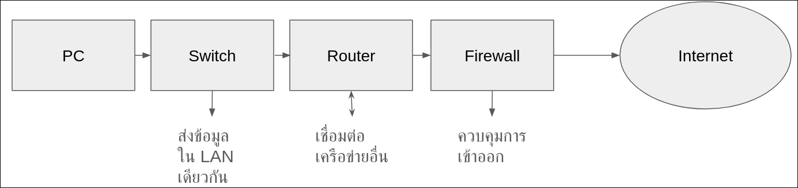
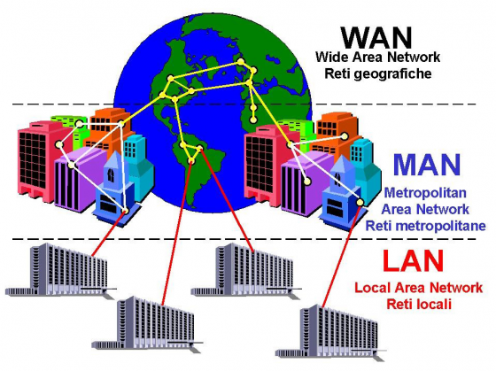

# Basic Networking

## Networking Fundamentals
- เป้าหมาย
    - สามารถเข้าใจว่า Network คืออะไร
- ลองคิดภาพตามผมนะครับ
    - แทน Network คือการสื่อสารกันภายในบริษัท
    - พวก PC/Laptop ก็จะเหมือนพนักงานในบริษัท
        - พนักงานเป็นผู้ส่ง/รับข้อมูล เช่นเดียวกับ PC
        - หัวใจหลักของงานเครือข่ายคือ “การให้ PC สื่อสารกันได้” — ไม่ว่าจะเป็นการแชร์ไฟล์, โหลดเว็บ, หรือส่งอีเมล
    - Switch คือกลุ่มจัดเอกสารในแผนกเดียวกัน
        - Switch ทำหน้าที่กระจายข้อมูลเฉพาะคนใน LAN เดียว ทำให้เหมือนกับกลุ่มจัดเอกสารที่ส่งเฉพาะคนในแผนก
        - ปัญหาส่วนใหญ่ใน LAN มาจากการเชื่อมต่อและ MAC Address Table ฉนั้น Switch คือหัวใจของ Layer 2 (เดี๋ยวผมอธิบาย OSI Layer ภายหลัง)
    - Router คือกลุ่มประสานงานระหว่างแผนก
        - เมื่อข้อมูลจะออกไปนอกแผนก (LAN) ก็ต้องผ่าน Router ซึ่ง ก็เหมือนการประสานงานกับแผนกอื่น
        - Key หลักของ Routing คือการกำหนดเส้นทางไปยัง Subnet ปลายทาง (เดี๋ยวผมอธิบายภายหลังว่าคืออะไร)
    - Server คือห้องเก็บเอกสารส่วนกลาง
        - เป็นแหล่งข้อมูลหลัก เช่นเดียวกับ Server ที่ให้บริการ Web, FTP, DNS
        - หัวใจหลักของเครือข่ายองค์กรคือการเข้าถึง Server ไม่ว่าจะเป็น File Server, Web Server, หรือ Database
    - Firewall คือ รปภ.ในบริษัท
        - ควบคุมว่าใครเข้าออกได้บ้าง — ป้องกันไม่ให้คนนอกแอบเข้ามา
        - Key หลักของ Security Policy คือการจำกัดการเข้าถึง — ใช้ Firewall หรือ ACL เพื่อบล็อก Traffic ที่ไม่พึงประสงค์
    - IP Address คือรหัสประจำตัวพนักงาน
        - ระบุตำแหน่งของอุปกรณ์ในเครือข่าย — คล้ายกับการมีเลขพนักงานเพื่อแยกแยะว่าใครเป็นใคร
        - ปัญหาเครือข่ายหลายครั้งเกิดจากเกิดจาก IP Conflict หรือ IP ผิด Subnet — เข้าใจ IP แล้ว ปัญหาหลายอย่างหายไป
    - MAC Address คือรหัสประชาชนของพนักงาน
        - ระบุตัวตนของอุปกรณ์ในระดับคล้ายเลขประชาชนของเรา — ไม่ซ้ำกันในโลกจริง เพราะพวกอุปกรณ์จะถูกตั้ง MAC Address มาตั้งแต่ในโรงงานเลย
        - เนื้อหาส่วนใหญ่ของ Layer 2 คือการใช้ MAC Address เพื่อส่งข้อมูล 
- 

## ประเภทของ Network
- 
- Local Area Network (LAN)
    - เปรียบเหมือน “บ้าน” หรือ “สำนักงานเล็ก ๆ” ที่คนภายในสามารถพูดคุยกันและแบ่งปันของใช้ร่วมกัน เช่น ปริ้นเตอร์ ไฟล์เอกสาร
    - ระยะทางไม่ไกลมาก (ประมาณ 100 เมตร)
    - ใช้เทคโนโลยีเช่น Ethernet, Wi-Fi
    - มักพบใช้บ้าน, โรงเรียน, ออฟฟิศขนาดเล็ก
- Metropolitan Area Network (MAN)
    - ครอบคลุมทั้งเมือง อาจยาวถึง 40 กิโลเมตร
    - ใช้เชื่อมต่อหลายสาขาขององค์กรเดียวกันในเมืองเดียวกัน
    - ตัวอย่าง: เครือข่ายมหาวิทยาลัย
- Wide Area Network (WAN)
    - ครอบคลุมพื้นที่กว้างมาก เช่น อินเทอร์เน็ต
    - ใช้เทคโนโลยีเช่น สายเคเบิลใต้ทะเล, ดาวเทียม หรือบริการจากผู้ให้บริการอินเทอร์เน็ต

## OSI Model และ TCP/IP Model
- ### OSI model
    - OSI Model เป็นแบบแผนหรือโมเดลที่แบ่งการทำงานของเครือข่ายออกเป็น 7 ชั้น (Layers)
    - 
    | Layer | ชื่อ Layer | หน้าที่หลัก | การเปรียบเทียบ |
    |-------|-------------|--------------|------------------|
    | **7** | Application Layer | ผู้ใช้โต้ตอบกับแอป เช่น อีเมล, เว็บ | เปรียบเสมือน **คุณ** ที่เขียนจดหมายหรือเปิดอ่านจดหมาย |
    | **6** | Presentation Layer | แปลงข้อมูล เช่น เข้ารหัส, บีบอัดไฟล์ | เปรียบเหมือน **นักแปลภาษา** หรือคนจัดรูปแบบเอกสาร |
    | **5** | Session Layer | จัดการเซสชัน เช่น เริ่ม/จบการเชื่อมต่อ | เปรียบเหมือน **พนักงานรับพัสดุ** ที่เริ่มกระบวนการส่งของ |
    | **4** | Transport Layer | ส่งข้อมูลจากต้นทางถึงปลายทาง เช่น TCP/UDP | เปรียบเหมือน **ศูนย์คัดแยกพัสดุ** ที่แบ่งจดหมายเป็นชิ้นเล็กๆ |
    | **3** | Network Layer | กำหนดเส้นทางการส่ง เช่น IP Address, Routing | เปรียบเหมือน **แผนกวางแผนเส้นทาง** ที่ใส่ที่อยู่และหาเส้นทาง |
    | **2** | Data Link Layer | ส่งข้อมูลในเครือข่ายเดียวกัน เช่น MAC Address | เปรียบเหมือน **รถส่งพัสดุในพื้นที่** ที่ส่งจดหมายในเขตใกล้เคียง |
    | **1** | Physical Layer | ส่งข้อมูลเป็น bits (0s และ 1s) ผ่านสายหรือคลื่น | เปรียบเหมือน **ถนนหรือสายไฟ** ที่รถใช้วิ่ง |
    - 

- ### TCP/IP model